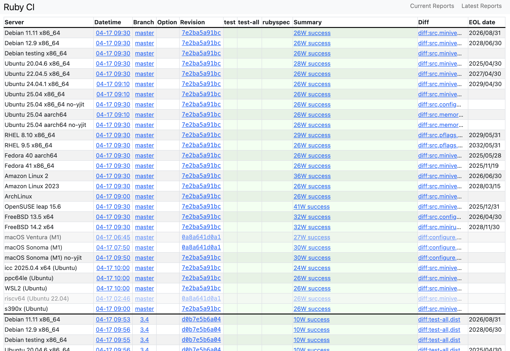

# riscv64.rubyci.org internal

author
:   Kazuhiro NISHIYAMA

institution
:   株式会社Ruby開発

content-source
:   RubyKaigi 2025 LT

date
:   2025-04-17

allotted-time
:   5m

theme
:   lightning-simple

# What's rubyci.org?

- A *CI* results summary site
  - <https://rubyci.org/>
- Runs *chkbuild* on various CI environments
  - <https://github.com/ruby/chkbuild>
- Most environments run *all* supported Ruby versions.
- Some environments run *only on the master branch*.
  - JIT variants, Android, *riscv64*.

## note

まず、rubyci.org とは、いろんな環境で実行しているRubyのCIの結果のまとめサイトです。
各 CI 環境で chkbuild を実行しています。
ほとんどの環境では現在サポートされている ruby の全バージョンを実行しています。
いくつかの環境ではマスターブランチのみ実行しています。

# rubyci.org

{:relative_height='100'}

## note

実際の rubyci.org はこんな感じで、私がメンテナンスしている risc 環境は最新の revision で実行できていないので、ちょっと薄くなっている行になります。

# Why do I maintain the riscv64 VM?

- I am interested in *minor environments* and run tests on them. They may uncover interesting bugs.
- *`qemu-system-riscv64`* has become easier to use recently.
- When I took over *the riscv64 VM*,
  there was an environment created by mame-san,
  but it was slightly outdated.
- I made *some improvements* and will share *one of them* here.

## note

次に、なぜ私が risc 環境のメンテナンスをしているかと言うと、マイナーな環境でテストを実行するとバグがみつかるかもしれないからです。
最近は qemu で実行しやすくなっているのも理由のひとつです。
まめさんが作成した環境がすでにあったのですが、少し古くなっていたので引き継いでメンテナンスしています。
いくつか工夫が必要だったので、そのうちのひとつを紹介します。

# Premise

- `qemu-system-riscv64` runs on host environments and is *very slow*.
  - CPU emulation with qemu-system takes much longer than running on real hardware.
- Therefore, it runs *only on the master branch*.
- Even so, it can take *hours* (e.g., 7 hours).

To avoid wasting time by interrupting CI due to reboots, I devised a way to reboot between CI runs.

## note

前提として、qemu 環境は非常に遅いので、マスターブランチのみ実行しています。
それでも、7時間ぐらいかかっています。

そのため、再起動で CI が中断すると非常に無駄が大きいので、CI の実行の合間に再起動するように工夫しました。

# How to run without interruption

- `unattended-upgrade` sometimes requires a reboot
  after upgrading packages.
  - It creates `/run/reboot-required`.
- I allocate an hour for maintenance between chkbuild runs.
  - The machine reboots during this time if necessary.

## note

パッケージの更新後に再起動が必要になると `unattended-upgrade` が `/run/reboot-required` を作成します。
`chkbuild` の実行の合間にメンテナンス時間をとっていて、ファイルの存在をチェックして、必要ならそこで再起動するようにしました。

# Guest VM and Host OS

- It is relatively easy to wait for the guest VM to reboot itself.
- However, the host OS also needs to handle reboots.

## note

これでゲストVM自体の再起動は簡単に待てるようになりましたが、
ホストOSの再起動も待つ必要があります。

# How to wait?

- The guest and host cooperate using a shared directory.
  - After chkbuild finishes, it updates the `mtime` of a specific file in the shared directory.
  - A custom systemd path unit detects the `mtime` change
    and reboots both the guest and host if necessary.
- Pros:
  - Loose coupling between components.
  - The notifier requires fewer privileges.
  - Usually no maintenance is required.

## note

そこで、共有ディレクトリを使って通知するようにしました。
具体的にはchkbuildが終わったときに、特定のファイルの mtime を更新して、
systemd の path unit で検出して、必要なら再起動します。
この方法の利点は、疎結合にできるのと、通知側の権限を少なくできる、というところです。
そして、普段はメンテナンス不要にできました。

# Are you interested?

- If you want Ruby to support your favorite environments better:
  - Set up your own CI environment to run chkbuild.
    - Use `start-rubyci` in `ruby/chkbuild`.
  - Add your results to `rubyci.org`.
    - Contact the `rubyci.org` maintainers to add your chkbuild output URLs.
  - If tests fail, fix them, report issues, or take other actions.

## note

こんな感じで、まだあまりテストされていない環境でのrubyをもっとサポートしたいと思ったら、
chkbuild を動かす環境をととのえて、 rubyci.org に追加してもらうと良いでしょう。
そして、テストが失敗したら、何か対処してください。

# self.introduction

- Kazuhiro NISHIYAMA
- One of the Ruby Committers
- GitHub, etc.: `@znz`
- 株式会社Ruby開発 www.ruby-dev.jp
  - We are hiring!

## note

最後に自己紹介です。
Ruby コミッターのひとりで、github などはゼットエヌゼットというアカウントで活動しています。
株式会社Ruby開発に所属しています。採用強化中なので興味があればよろしくお願いします。
以上で発表を終わります。

# 株式会社Ruby開発

{:relative_height='100'}
